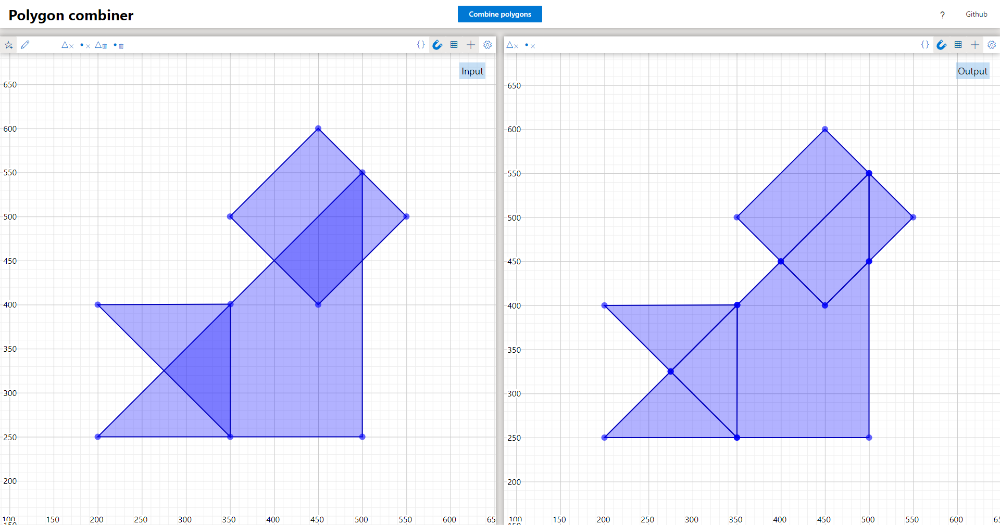

# faces-in-plane

This repository contains a typescript implementation of an algorithm I came up with to get the intersection of multiple polygons. It calculates what faces would result from adding multiple simple polygons to the same plane.

A demo of the algorithm can be found at [tarvk.github.io/faces-in-plane/demo/build/](https://tarvk.github.io/faces-in-plane/demo/build/). There is also [a pdf](https://github.com/TarVK/faces-in-plane/blob/main/explanation/algorithm.pdf) that explains how the algorithm works.

## Results

### Robustness

The algorithm does suffer from some robustness issues, which I did not manage to solve. Solving these probably requires some changes to the core algorithm, rather than patches to the implementation. Since I now know what dangers to look out for, I may try to redesign the algorithm in the future so it doesn't suffer from these robustness issues.

### Complexity

If a immutable set instead of an array was used to store the sources of all output polygons, the algorithm could run in `O((n + k) * log n)` time where `n` is the number of vertices in the input and `k` is the number of polygons in the output.
Currently it runs in `O((n + k) * (s + log n))` where `s` is the maximum number of overlapping polygons in the input.
